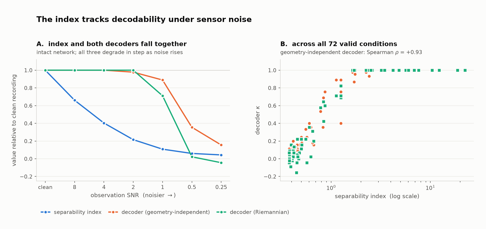
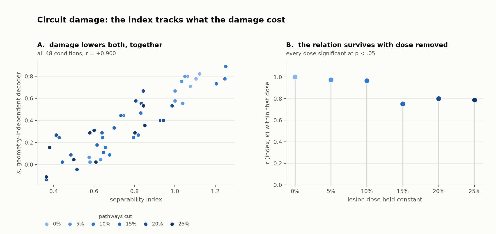
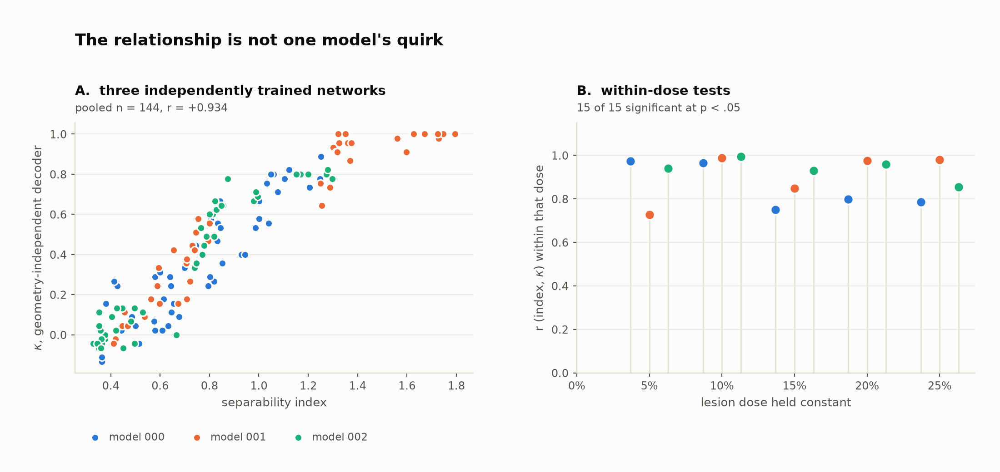
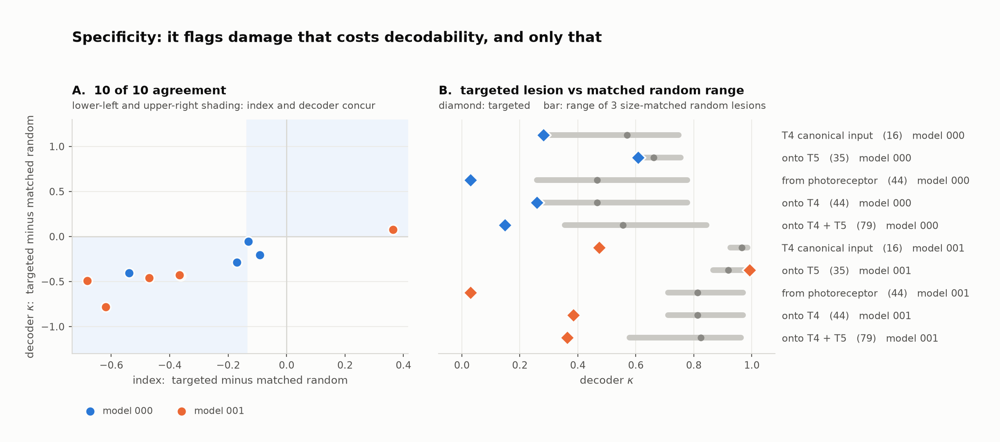

# Does a classifier-free separability index track real decodability?

A validation study on **flyvis**, connectome-constrained models of the *Drosophila*
visual system (Lappalainen et al., *Nature* 2024), where the wiring is known and
can be cut on purpose.

**The question.** Riemannian separability indices are used as *classifier-free*
proxies for how decodable a neural population is: compute a covariance per trial,
take the ratio of between-class to within-class affine-invariant geodesic distance,
and read that as "how much class structure is here", without ever training a
decoder. The index is cheap and decoder-agnostic, which is the appeal. But in real
recordings you can never check it against ground truth, because you cannot delete a
pathway and see what the loss was worth.

In a connectome-constrained model you can. This repository does that.

**The short answer.** The index tracks decodability (pooled *r* = +0.93 over three
independently trained networks), it keeps tracking it when lesion dose is held
constant, and, in the test that actually needed the ground truth, it **fires on
damage that costs decodability and stays quiet on damage of the same size that
doesn't**.

---

## Method in one paragraph

A pretrained flyvis network (45,669 neurons, 65 cell types, 1.51 M synapses) is
shown drifting gratings at four motion directions, a 4-class task. Population
activity is read from the 12 most variable central cells, one per cell type. Two
things are then done to it: **observation noise** is added to the readout (a
recording-side failure: the information is still in the network) and **connectome
pathways are deleted** by zeroing entries of `edges_syn_strength`, one per
(source type → target type) pair (a network-side failure: the information is
genuinely gone). Every condition is scored three ways: the separability index,
a **geometry-independent** decoder (log-variance + LDA), and a Riemannian decoder
(tangent space + LDA), all with 5-fold cross-validation.

The geometry-independent decoder is the one that matters: a Riemannian decoder
shares its metric with the index, so agreement between those two proves nothing.

## Results

### 1. Index and decodability degrade together under sensor noise



Adding observation noise to an intact network degrades the index and both decoders
in step (ρ = +0.93 against the geometry-independent decoder). The index is *not*
merely a restatement of the Riemannian decoder; the geometry-independent one
agrees at least as well.

### 2. Under circuit damage, at fixed dose



Deleting 0-25 % of pathways at a non-saturated operating point: *r* = +0.90 overall.
The control that matters is on the right: recomputing the correlation **within each
lesion dose**, where the amount of damage is identical and only *which* pathways
were cut differs. Significant at every dose. The index is not tracking the dose; it
is tracking what a particular pattern of damage destroyed.

Variation across *which* pathways were cut (SD 0.27) exceeds variation across *how
many* (SD 0.20).

### 3. It replicates across the ensemble



Three independently trained networks. Pooled *r* = +0.934, ρ = +0.950 (n = 144),
and **15 of 15 within-dose tests significant**.

### 4. Specificity: it does not fire on damage that costs nothing



Anatomically targeted lesions (cut everything onto T4; onto T5; the canonical
Mi1/Tm3/Mi4/Mi9 → T4 motion inputs; all photoreceptor output) each compared against
**three random lesions of exactly the same size**.

Seven targeted sets landed below every one of their matched random controls; the
index flagged 7/7. Three did not; the index flagged 0/3. **Agreement 10/10.**

The clearest single case: cutting 35 pathways onto T5 in model 001 leaves κ at
0.993 (intact 0.993) and the index at 1.760 (intact 1.757). Thirty-five pathways
deleted, nothing lost, and the index correctly does not move.

Note what is *not* claimed: **which** pathways matter is model-dependent. `onto_T4`
is below all randoms in one network and inside the random range in another. Two
networks trained on the same connectome distribute the task differently. The claim
is about the index agreeing with the decoder case by case, not about anatomy.

---

## The retraction

`docs/LOG.md` §2 is a retraction, and the figure it produced is deliberately
still in `figures/00_retracted_result.png`.

An earlier version of this work reported a headline "dissociation": the index
collapsing 11× while decoding stayed perfect. It was wrong, for two independent
reasons, either fatal alone:

1. Noise was scaled to each channel's own amplitude, multiplying every channel's
   variance by the same factor, a constant shift of all log-variance features,
   which LDA is invariant to. The manipulation could not move a log-variance
   decoder by construction.
2. Features were taken from data already z-scored along time, so `var(axis=2)` was
   identically 1 (measured range `[0.999999999983, 0.999999999998]`, spread
   1.5e-11 against 4.60 un-z-scored). The "perfect decoding" was LDA separating
   floating-point round-off. Structureless noise through the same pipeline scores
   κ = −0.133.

The script had a guard meant to catch exactly this. It did not fire, because 1.000
appeared alongside seven other values and its distinctness test passed. **A check
that cannot fail in the case it exists for is not a check.** The replacement guard
runs the pipeline on structureless input and aborts if |κ| > 0.15.

Corrected, the conclusion reversed: see `docs/LOG.md` §3.

A second, smaller instance: the pathway-index verification originally checked
behaviourally that zeroing `R1 → L1` moved L1 most. That passed on one model and
*falsely failed* on another, because L1 is driven by R1-R6. It was replaced with a
structural check: the sign vector implied by our grouping must equal flyvis's own
`edges_sign`, 604/604, with a shuffled-order control that must fail.

## What this does not establish

Three models of 51 available. Hand-built grating stimuli, 15 trials per class,
one noise family, one operating point (SNR = 1.0, itself created by added noise).
Three lesion seeds per dose; for two same-size targeted sets the matched random
controls are the same three draws (a seed that depended on size only; fixed for
future runs, noted because it means three fewer independent controls than the
condition list suggests). Anatomical lesions are not optimised, so nothing here
bounds "the worst possible k-pathway lesion". This is a simulated system; none of
it is evidence about human recordings.

## Reproduce

```bash
conda create -n flyvis python=3.12 -y -c conda-forge --override-channels
conda activate flyvis
pip install flyvis pyriemann
flyvis download-pretrained          # ~7 MB

python code/01_feasibility.py                        # shapes, SPD/rank
python code/03_noise_axis.py                         # noise axis (corrected)
python code/04_calibration.py                        # operating point
python code/05_damage_axis.py                        # damage axis at fixed dose
FLYVIS_MODEL=flow/0000/001 python code/06_ensemble.py
FLYVIS_MODEL=flow/0000/001 python code/07_targeted.py
```

flyvis requires Python < 3.13. Every script is resumable: completed conditions are
skipped on restart. `Network.simulate` raised on Apple MPS during testing and the
scripts fall back to CPU automatically. Roughly 60 s per condition on an Apple M2.

## Files

| | |
|---|---|
| `code/01_feasibility.py` | shapes, SPD/rank, the false-PASS catch |
| `code/02*_retracted_*.py` | the retracted analysis, kept for the record |
| `code/03_noise_axis.py` | noise axis, after the correction |
| `code/04_calibration.py` | why class similarity fails as a difficulty knob |
| `code/05_damage_axis.py` | damage axis at fixed dose |
| `code/06_ensemble.py` | replication across trained models |
| `code/07_targeted.py` | targeted vs matched-random lesions |
| `docs/LOG.md` | the full record, including both retractions |
| `figures/` | every figure in this README |
| `results/*.csv` | every condition, with validity flags |

Scripts keep the output filenames they were written with (`results/stepN_*.csv`);
the `code/` numbering is reading order, not a rename of those outputs.

The separability index is the ratio of mean between-class to mean within-class
affine-invariant geodesic distance on trial covariance matrices, computed with
[`pyriemann`](https://github.com/pyRiemann/pyRiemann). Its definition is held
byte-for-byte identical across every script here, so that a difference between
runs is attributable to the manipulation and not to the measure.

Connectome models: [flyvis](https://github.com/TuragaLab/flyvis), Lappalainen et
al., *Connectome-constrained networks predict neural activity across the fly
visual system*, Nature (2024).
